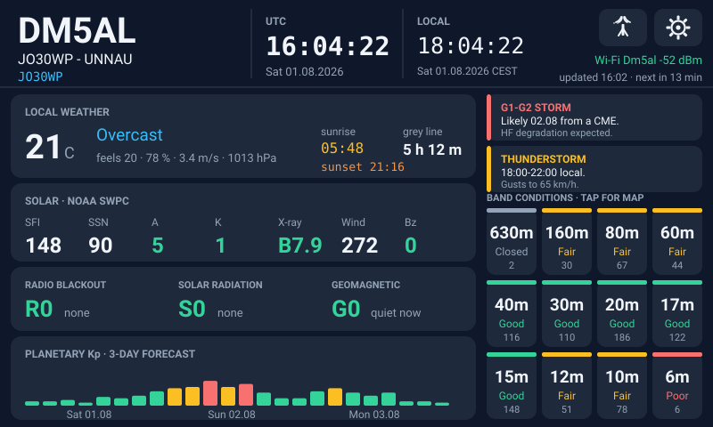
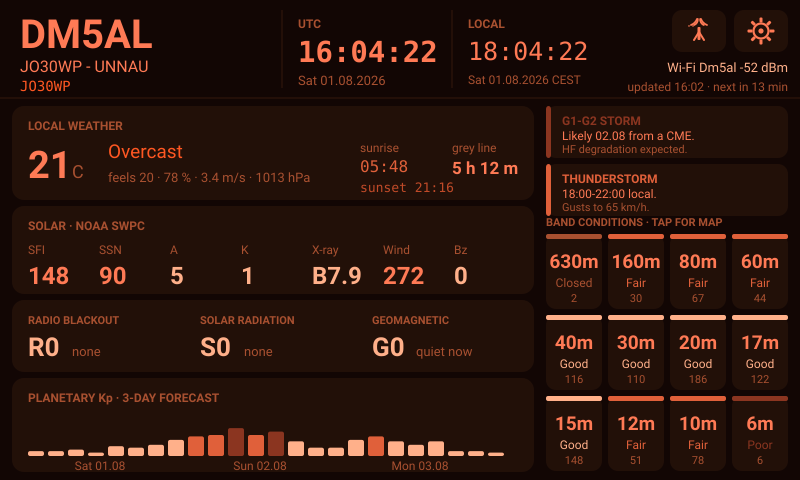
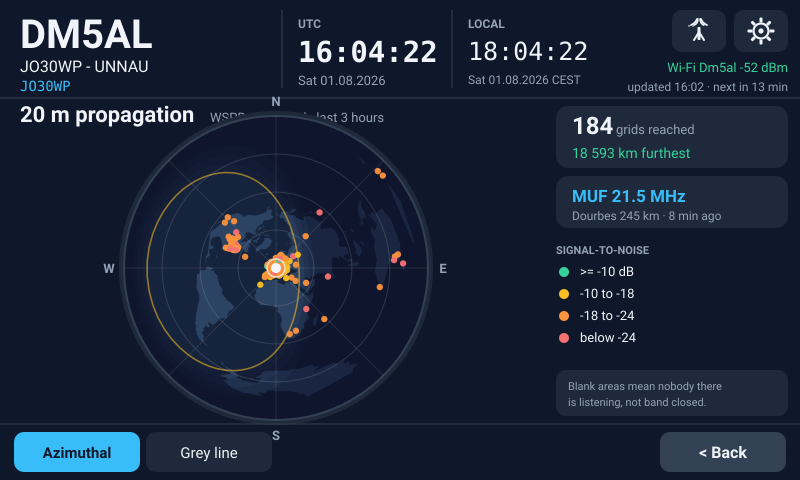
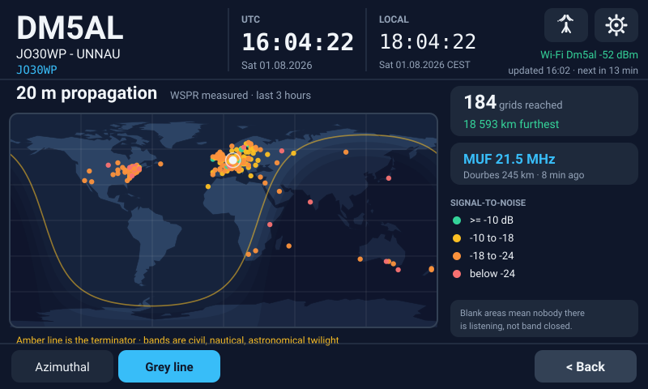
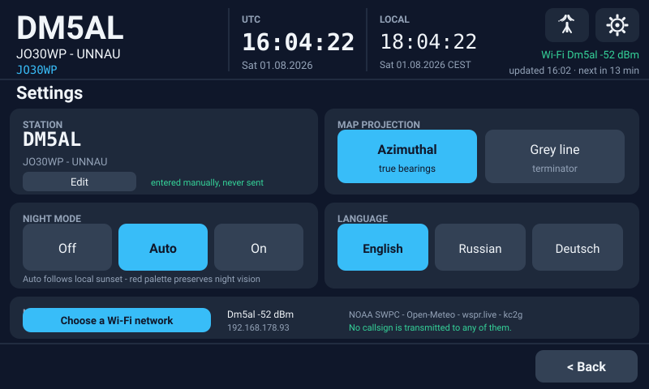
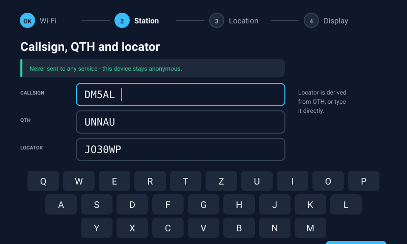

# Screens

> **These are design renders, not photographs.**
>
> They were drawn to argue about the layout before the firmware existed, and
> they are kept because they still communicate the intent. The shipping UI has
> moved on in places — the beacon page became the DX cluster, the header gained
> a second clock and a DX/home button, the maps gained bearing spokes, and the
> warnings card became a three-level info panel.
>
> Photographs of the real panel are wanted and would replace these. See
> [Contributing a photo](#contributing-a-photo).

All renders use the author's own station: **DM5AL**, Unnau, **JO30WP**.

## Home

Left column is what is happening now: weather, sunrise, sunset, time to the next
grey line, then the solar indices, the R/S/G scales and a three-day Kp forecast.

Right column is where to go: the info panel, then twelve band buttons showing
measured conditions. Tapping a band opens its map.

The night palette is red-only to preserve dark adaptation. Because red alone
cannot encode hue, conditions are separated by **brightness** rather than
colour — any new status indicator has to work under both.

## Propagation map — azimuthal

Azimuthal equidistant, centred on the QTH. Screen direction **is** the beam
heading and radius is proportional to true distance, so the map answers "where
do I point the antenna". The shipping version adds bearing spokes every 30° with
degree labels; straight up is true north.

Every dot is a grid square that actually heard a WSPR signal from this region in
the last three hours. An empty sector means nobody there is listening — not that
the band is shut, which is a distinction worth keeping in mind before concluding
anything from a sparse map.

## Propagation map — grey line

Equirectangular, which cannot show bearings but can show the terminator — the
thing you want when chasing low-band openings. Day and night are computed per
pixel, so twilight is a smooth gradient rather than stepped bands.

## Settings

Station identity, language, units, network. Data sources are listed on the
device itself: for a project whose whole claim is *measured, not modelled*,
saying where the numbers come from belongs on the screen and not only in a
README.

## Commissioning

Three steps: language and units, then Wi-Fi, then identity. Language comes first
so the rest of the assistant is read in the language the operator wanted.

The privacy promise is stated on the station step, immediately beside the field
where the callsign is typed. That is the moment someone wonders where it goes,
and a README they will never read is not an answer.

## Contributing a photo

Photographs of a real panel are more useful than any render. If you build one:

- Shoot square-on in even light; an angled shot of an LCD shows colour shift
- Avoid flash — the backlight and a flash never balance
- 1600 px wide or better, PNG or JPEG
- Both palettes if you can, and both board sizes

Open a pull request adding them to `docs/img/`, or send them to
<support@dm5al.de>.
